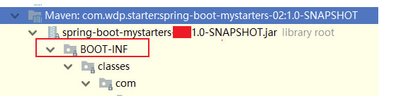
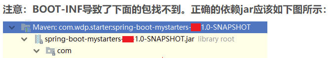

# cid-spring-boot-starter


## Getting started

Spring Boot Starter使Interceptor自动生效: 
<br> 1.Starter中创建一个注解EnableParam
<br> 2.Starter中创建一个ImportSelector
<br> 3.Starter中创建Config来拦截URL(WebMvcConfig/DefaultWebMvcConfig)
<br> 4.在SpringBoot的启动文件上增加[@EnableParam]这个注解

###### 再启动Spring Boot项目时候，自定义的Interceptor就会自动生效了，不需要再在Spring Boot项目中创建一个Config继承咱们在Starter中的DefaultWebMvcConfig了。
#### 注意:引入自定义springboot的starter后却找不到相关的类（BOOT-INF文件夹的坑）



#### 如何解决：
在自定义的starter项目的pom文件中的maven插件里面设置configuration标签如下:
- [ ] [Create](https://docs.gitlab.com/ee/user/project/repository/web_editor.html#create-a-file) or [upload](https://docs.gitlab.com/ee/user/project/repository/web_editor.html#upload-a-file) files
- [ ] [Add files using the command line](https://docs.gitlab.com/ee/gitlab-basics/add-file.html#add-a-file-using-the-command-line) or push an existing Git repository with the following command:

```
    <build>
        <plugins>
            <plugin>
                <groupId>org.springframework.boot</groupId>
                <artifactId>spring-boot-maven-plugin</artifactId>
                <!--安装到仓库后，引用时不出现 BOOT-INF文件夹（会导致找不到相关类）-->
                <configuration>
                    <skip>true</skip>
                </configuration>
            </plugin>
        </plugins>
    </build>
```
